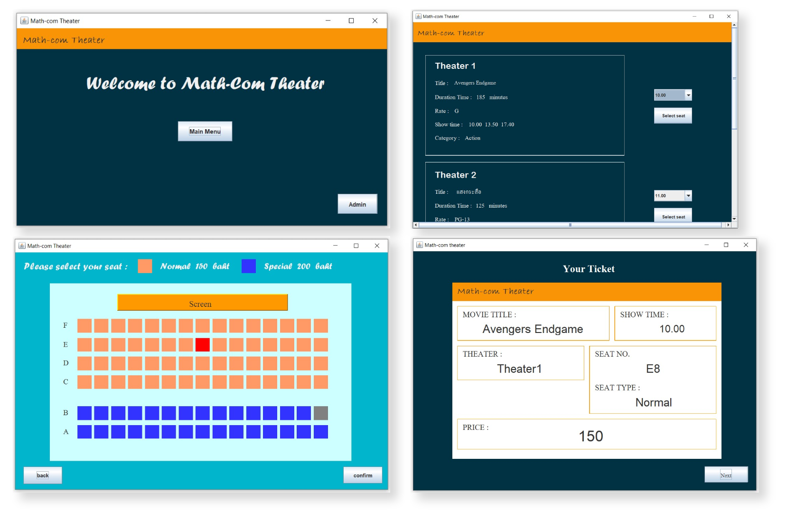

# MovieBooking-DesktopApplication

Movie Booking project is a movie booking desktop application and a term project in Programming Technique course. In this project, I use Java and NetBeans IDE for creating this application. I received the requirement from my professor that my ticket reservation system should allow bookings in a few easy steps. This is my first application that I created by Java. So, it will not has good UX/UI as it should be. However, this project let me practice OOP concept and how I can use Java to create UI. 

### Technologies

### Description
Movie Booking App has 2 parts for user and admin.
- Admin - use for manage this app to add, remove or edit movie list.
  - You will see the admin button at the right-bottom of the screen
  - After click the button, it will appear the login page
  - Fill username and password then click confirm
  - The window will appear all movie list and you can add, remove and edit each movie
  - After you are satisfied, click save button and return to main menu
- User - can see movie list, choose seat and see the result cost.
  - First, click main menu button and then the movie list will appear
  - In each theater will display title, duration time, rate, show time and category
  - You can book the ticket by choosing the time at the dropdown and then click select seat
  - There are 2 kind of seat: normal 150 baht and special 200 baht 
  - Each theater has 6 rows of seat (A-F)
  - you can select only one seat per booking, the seat that was booked will style in gray color, the seat that you choose will style in red color
  - Click confirm to book
  - The app will give you a ticket with important information which is movie title, show time, theater number, seat number, seat type and price

